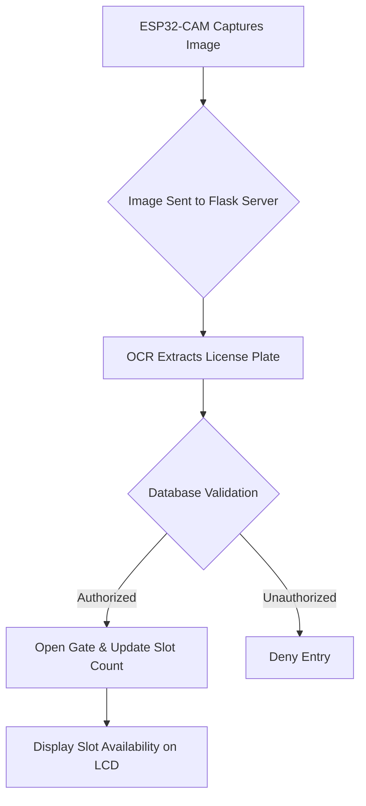

# 🚗 Autonomous Smart Parking System 🅿️

**A smart parking solution integrating license plate recognition, IoT, and embedded systems for automated vehicle entry/exit management.**  
🌟 *Enhances urban parking efficiency and security with real-time authorization checks!*

---

## 📌 Table of Contents
- [Project Overview](#-project-overview)
- [Key Features](#-key-features)
- [System Workflow](#-system-workflow)
- [Hardware Components](#-hardware-components)
- [Software Requirements](#-software-requirements)
- [Installation & Setup](#-installation--setup)
- [Database Configuration](#-database-configuration)
- [Usage](#-usage)
- [Contributing](#-contributing)
- [License](#-license)

---

## 🌟 Project Overview
This system automates parking lot management using:
- **ESP32-CAM** 📸: Captures license plate images and sends them to a Flask server.
- **Flask Server** 🖥️: Processes images with OpenCV and Tesseract OCR, validates plates against a MySQL database.
- **Arduino Gate Controller** 🚪: Manages IR sensors, servo motor, and LCD display for slot availability.
- **MySQL Database** 🗃️: Stores authorized vehicle plates for real-time validation.

---

## 🔑 Key Features
- **Real-Time License Plate Recognition** 🚘  
  OCR-powered extraction using Tesseract and OpenCV.
- **Automated Gate Control** 🔄  
  Servo motor opens/closes gate based on slot availability and authorization status.
- **Slot Management** 🚧  
  LCD displays real-time parking availability (max 5 slots by default).
- **Secure Validation** 🔒  
  Cross-checks plates against a database of authorized vehicles.

---

## 🔄 System Workflow

## 🛠️ Hardware Components
ESP32-CAM Module 

Arduino Uno/Nano

IR Sensors (x2)

Servo Motor (SG90)

16x2 I2C LCD Display

Jumper Wires & Breadboard

## 💻 Software Requirements
1. Python 3.8+ 🐍

2. Libraries: Flask, OpenCV, pytesseract, mysql-connector-python

3. Tesseract OCR 

4. Arduino IDE 

5. MySQL Server

⚙️ Installation & Setup
  
  Clone the Repository
  git clone https://github.com/shahishnujr/Autonomous-smart-Parking-System.git
  cd autonomous-smart-Parking-System

Python Environment Setup
  python -m venv venv

Configure ESP32-CAM

Update CameraWebServer.ino with your Wi-Fi credentials and Flask server IP.

Upload to ESP32-CAM via Arduino IDE.

## 🗃️ Database Configuration
Create MySQL Database
  CREATE DATABASE Authorised_Vehicles;
  USE Authorised_Vehicles;
  CREATE TABLE vehicleList (vehicle_number VARCHAR(15) PRIMARY KEY);

Add Authorized Plates
  INSERT INTO vehicleList (vehicle_number) VALUES ('ABC123'), ('XYZ789');

## 🚀 Usage
Start Flask Server
  python Base.py

Server runs at http://[your-ip]:5000.

Run Arduino Controller
Upload Smart_Parking_Code_1.ino to Arduino and connect hardware as per pin definitions.

Test the System

Trigger IR1 (entry) or IR2 (exit) to simulate vehicle movement.

Check LCD for slot updates and server logs for OCR results.
